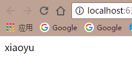

# fetchdemo
### how cool it is to fetch data not using ajax (i mean not the XHR)
 尝试把之前学的关于新一代的fetch API知识写了一个小例子，很简单的几行代码，做的一请求本地mock数据在页面的显示，感觉不用jQuery封装好的$ajax
 也不用自己手动写一个原生的XHR对象出来就可以完成数据的请求还是很‘清爽’的！
 还可以支持promise的语法，写起来真的是棒棒哒，可能唯一不足就是目前浏览器的支持度吧。。。额。。不想简单做个请求还非要整个框架。
 ### 代码
            window.onload = function fetchData () {
                    var target = document.getElementById('text');
                    var path = './mock.json';
                    var req = new Request(path,{method: 'GET',cache: 'reload'});
                    window.fetch(req).then(response=>{
                        return response.json()
                    }).then(json=>{
                        target.innerText = json.name;
                    })
            }
### 请求到的数据截图
 
